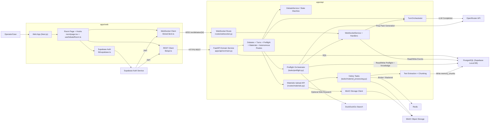
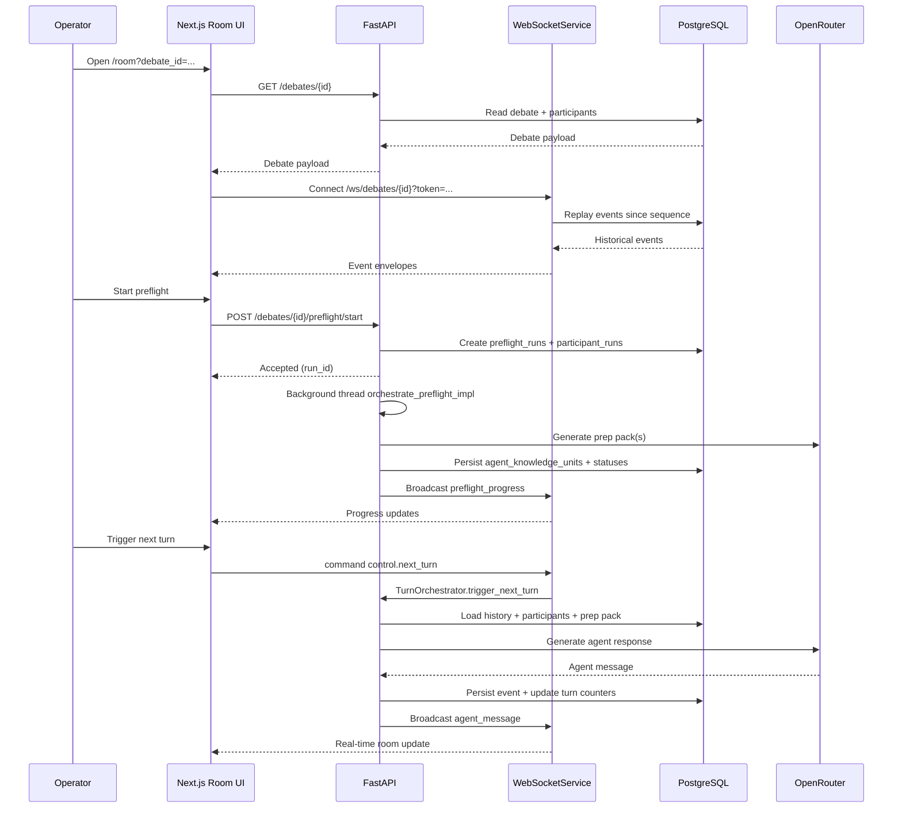

# System Architecture Diagram (Current Implementation)

Last updated: 2026-02-17

## 1) High-Level Component Architecture

## 2) Runtime Flow (Room + Preflight)

## Source Pointers

- `/Users/pv/Downloads/arinar-6-IPSS-V5/arinar-v2/apps/api/src/main.py`
- `/Users/pv/Downloads/arinar-6-IPSS-V5/arinar-v2/apps/api/src/routes/websocket.py`
- `/Users/pv/Downloads/arinar-6-IPSS-V5/arinar-v2/apps/api/src/routes/preflight.py`
- `/Users/pv/Downloads/arinar-6-IPSS-V5/arinar-v2/apps/api/src/tasks/preflight.py`
- `/Users/pv/Downloads/arinar-6-IPSS-V5/arinar-v2/apps/api/src/routes/materials.py`
- `/Users/pv/Downloads/arinar-6-IPSS-V5/arinar-v2/apps/api/src/tasks/material_processing.py`
- `/Users/pv/Downloads/arinar-6-IPSS-V5/arinar-v2/apps/api/src/turn_orchestrator.py`
- `/Users/pv/Downloads/arinar-6-IPSS-V5/arinar-v2/apps/web/src/app/room/page.tsx`
- `/Users/pv/Downloads/arinar-6-IPSS-V5/arinar-v2/apps/web/src/hooks/useDebateRoom.ts`
- `/Users/pv/Downloads/arinar-6-IPSS-V5/arinar-v2/apps/web/src/lib/api.ts`
